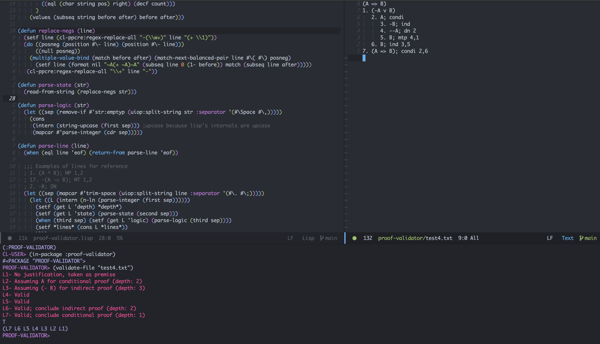

# proof-validator
### _Kenneth Sun <kennett.sun@gmail.com>_


(Screenshot of code running on my machine, using Doom Emacs, Sly, SBCL)

This program takes in .txt file(s) as input, where each line is a line in a proof, and validates according to the rules of propositional logic that each step is valid.
The program will note all occurances of improper usage but will always check every line assuming that the previous lines are valid.

The input should be formatted like so:

``` text
; proof.txt
B               <-- first line contains the claim to prove
1. (A => B)     ;lines without justification are taken as premises
2. A            ;this is also a premise
3. B; mp 1,2    ;use a semicolon(;) to seperate the statement of a line from its justification; a full list of operators can be found below

```


## Logical symbols

``` text
=>      Implies
<=>     Biconditional
^       Conjunction
v       Disjunction
[A-Z]*  Sequence of capital letters represent atomic statements (note that lowercase "v" is processed as the logical Or)
-       Negation
```
## Rules of inference

``` text
MP      Modus Ponnens               Requires 2 line arguments
MT      Modus Tonens                Requires 2 line arguments
MTP     Modus tollendo ponnens      Requires 2 line arguments
DN      Double Negative             Requires 1 line argument
Condi   Assume for conditional proof; if a line argument is given, indicates end of conditional proof
Ind     Assume for indirect proof; if a line argument is given, indicates end of indirect proof
Simp    Simplification              Requires 1 line argument
Add     Addition                    Requires 1 line argument
```

## License
MIT
